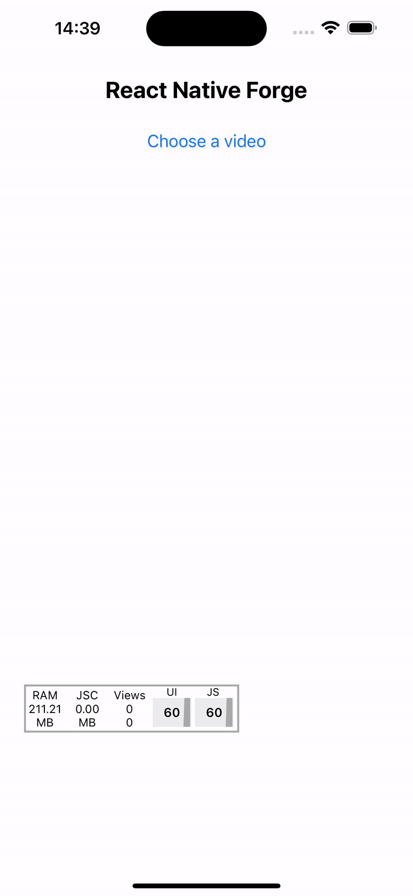

<p align="center">
  
</p>

# React Native Forge

A powerful video processing module for React Native and Expo. Providing essential video manipulation features with native implementation for iOS and Android

## Demo

<p align="center">
  
</p>

## Installation

```bash
npx expo install react-native-forge
```

## Features

- Generate video frames at specific timestamps
- Extract all frames from a video
- Get video duration
- Pad video to specific aspect ratios
- Cross-platform support (iOS, Android, Web)

## API Reference

### getAllFrames

Extracts all frames from a video at one-second intervals.

```typescript
function getAllFrames(
  inputPath: string,
  outputFolder: string,
  duration: number,
  size?: { width: number; height: number }
): Promise<string[]>;
```

Parameters:

- inputPath : Path to the input video file
- outputFolder : Directory where frames will be saved
- duration : Duration of the video in seconds
- size (optional): Desired dimensions for the output frames
  Returns: Promise resolving to an array of frame file paths

### getFrame

Extracts a single frame from a video at a specific timestamp.

```typescript
function getFrame(
  inputPath: string,
  outputPath: string,
  timestamp: number,
  quality?: number,
  size?: { width: number; height: number }
): Promise<string>;
```

Parameters:

- inputPath : Path to the input video file
- outputPath : Path where the frame will be saved
- timestamp : Time in seconds to extract the frame from
- quality (optional): JPEG compression quality (1-100, default: 15)
- size (optional): Desired dimensions for the output frame
  Returns: Promise resolving to the output file path

### padToRatio

Pads a video to match a specific aspect ratio.

```typescript
function padToRatio(
  inputPath: string,
  outputPath: string,
  targetRatio: number
): Promise<{ outputPath: string; ratio: number }>;
```

Parameters:

- inputPath : Path to the input video file
- outputPath : Path where the processed video will be saved
- targetRatio : Desired aspect ratio (width/height)
  Returns: Promise resolving to an object containing the output path and final ratio

### getDuration

Gets the duration of a video in seconds.

```typescript
function getDuration(inputPath: string): Promise<number>;
```

Parameters:

- inputPath : Path to the video file
  Returns: Promise resolving to the video duration in seconds

| Feature               | iOS | Android |
| --------------------- | --- | ------- |
| Generate All Frames   | ✅  | ✅      |
| Generate Single Frame | ✅  | ✅      |
| Pad Video             | ✅  | ✅      |
| Get Duration          | ✅  | ✅      |

## Example Usage

```typescript
import ReactNativeForge from "react-native-forge";

// Extract a frame at 5 seconds
const frame = await ReactNativeForge.getFrame(
  "file:///path/to/video.mp4",
  "file:///path/to/output.jpg",
  5,
  80,
  { width: 1280, height: 720 }
);

// Get video duration
const duration = await ReactNativeForge.getDuration(
  "file:///path/to/video.mp4"
);

// Extract all frames
const frames = await ReactNativeForge.getAllFrames(
  "file:///path/to/video.mp4",
  "file:///path/to/frames",
  duration,
  { width: 1280, height: 720 }
);
```

## License

MIT

## Contributing

Contributions are welcome! Please feel free to submit a Pull Request.
